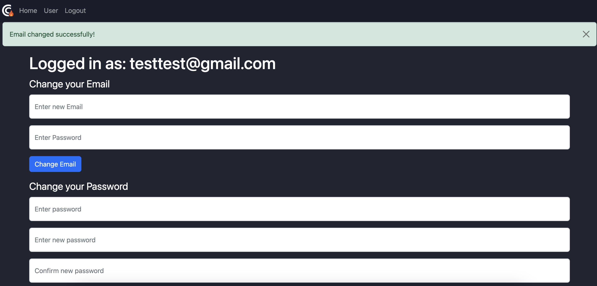
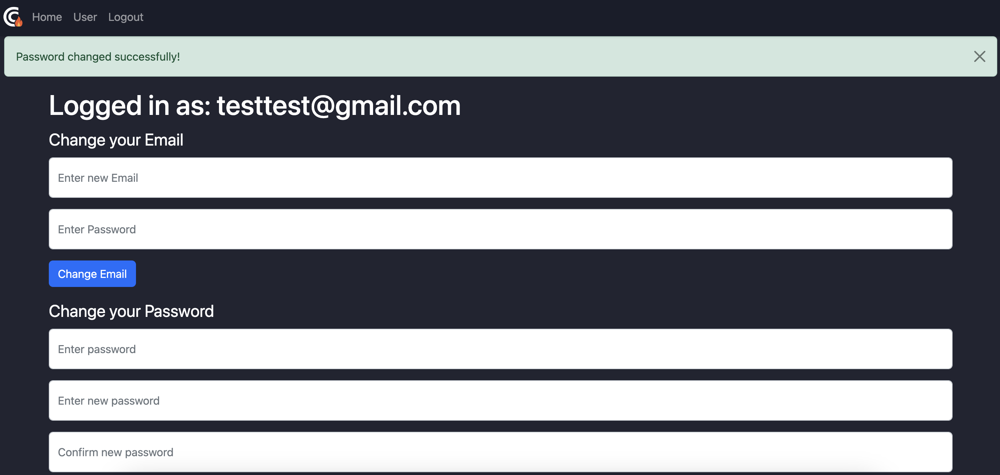

[Jane Dane]
{: .label }

# [API reference]
{: .no_toc }

  

    Table of contents
  

  {: .text-delta }
- TOC
{:toc}

## [Section / module]

### `function_definition()`

**Route:** `/route/`

**Methods:** `POST` `GET` `PATCH` `PUT` `DELETE`

**Purpose:** [Short explanation of what the function does and why]

**Sample output:**

[Show an image, string output, or similar illustration -- or write NONE if function generates no output]

---

## [Example, delete this section] Show to-do lists

### `get_lists()`

**Route:** `/lists/`

**Methods:** `GET`

**Purpose:** Show all to-do lists.

**Sample output:**

---

### `get_list_todos(list_id)`

**Route:** `/lists/<int:list_id>`

**Methods:** `GET`

**Purpose:** Retrieve all to-do items of to-do list with ID `list_id` from database and present to user.

**Sample output:**

---

## [Example, delete this section] Insert sample data

### `run_insert_sample()`

**Route:** `/insert/sample`

**Methods:** `GET`

**Purpose:** Flush the database and insert sample data set

**Sample output:**

Browser shows: `Database flushed and populated with some sample data.`

## [app.py]

### `change_email():`

**Route:** `/change_email`

**Methods:** `POST`

**Purpose:** allows a logged-in user to change their email address. It checks if the user is logged in and verifies the current password. If everything is correct, it updates the email address in the database and session, then notifies the user of the successful change.

**Sample output:**

## [app.py]

### `change_password()`

**Route:** `/change_password`

**Methods:** `POST` 

**Purpose:** allows a logged-in user to change their password. It performs checks to ensure the user is authenticated, the new password and its confirmation match, and the current password is correct. If all validations pass, it updates the user's password in the database.

**Sample output:**

