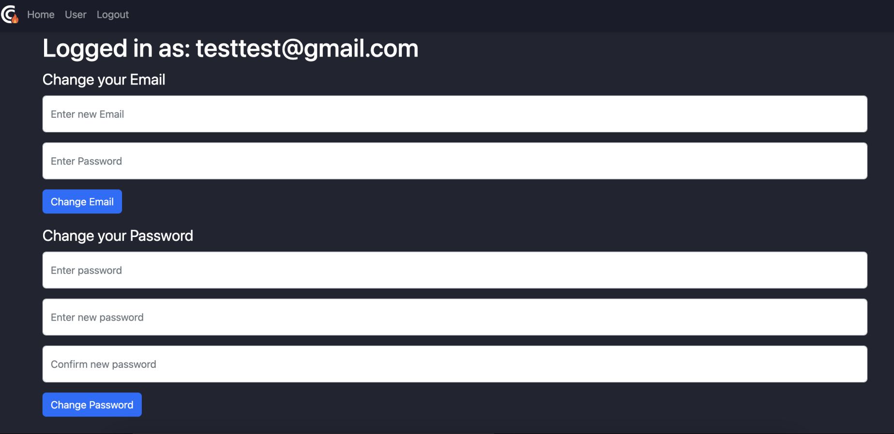

Michael Otieno
{: .label .label-red }
Linus Widing
{: .label }
Justin Grünberg
{: .label .label-green }

# API reference
In this section we go over all the different routes that belong to out application.Therefore we will go over normal app routes and routes that are dedicated to an extra API which is designed to be independent to the app´s logic. 
{: .no_toc }

  

    Table of contents
  

  {: .text-delta }
- TOC
{:toc}

## App routes

###  Login

`login()`

**Route:** `/login`

**Methods:** `"POST", "GET"`

**Purpose:** Handle login functionality.

**Sample output:**

---

###  Registration

`register()`

**Route:** `/register`

**Methods:** `"POST", "GET"`

**Purpose:** Handle register functionality.

**Sample output:**

---

###  Homepage
`index()`

**Route:** `/`

**Methods:** `"GET"`

**Purpose:** Render the homepage with different recipes. These recipes can be filtered to the users desire. Recipes are being queried via the API.

---

###  Recipe detail page
`get_recipe()`

**Route:** `/recipe/<recipe_id>`

**Methods:** `"GET"`

**Purpose:** Retrieve recipe with `recipe_id` from database and present it to user.

**Sample output:**

---

###  Populate database

`pop_db()`

**Route:** `/populate-db`

**Methods:** `"GET"`

**Purpose:** Flush the database and insert sample data set

**Sample output:**

---

### User settings
**Route:** `/user`

**Methods:** `"GET"`

**Purpose:** Change user information like E-Mail or password.

**Sample output:**

---

### Change E-Mail

`change_email():`

**Route:** `/change_email`

**Methods:** `"POST"`

**Purpose:** allows a logged-in user to change their email address. It checks if the user is logged in and verifies the current password. If everything is correct, it updates the email address in the database and session, then notifies the user of the successful change.

**Sample output:**

---

### Change password

`change_password()`

**Route:** `/change_password`

**Methods:** `"POST"` 

**Purpose:** allows a logged-in user to change their password. It performs checks to ensure the user is authenticated, the new password and its confirmation match, and the current password is correct. If all validations pass, it updates the user's password in the database.

**Sample output:**

---

## API routes
These routes are designed to provide a RESTful API for the data of this app. This is helpful to easily get or post data from different points in the app or to help other parties to access the data.

**Route prefix:** `/api` 

### Handle recipes

`handle_recipes()`

**Route:** `/recipes`

**Methods:** `"GET", "POST"` 

**Purpose:** Get or post recipes from the database. It is possible to get JSON of recipes that can be filtered via the url´s query string. You can also upload new recipes via a custom post request

---

### Handle favorite recipes

`handle_favorites()`

**Route:** `/toggle_favorite`

**Methods:** `"POST"` 

**Purpose:** Add and remove favorite recipes for different users. 

---