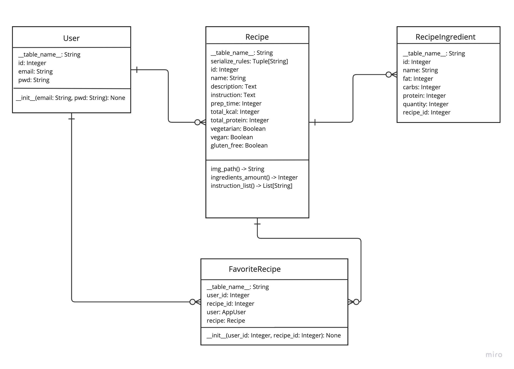

Justin Grünberg {: .label .label-green }

# App structure, incl. Data-Model

## Main Features

**Search for recipes**

**Filter recipes according to own diet and preparation time**

**Like recipes and add to favorite list**

**Create and publish own recipes**

## Sequence of main features

### Requirements

- log in or sign up successfully 
- you will be redirected to the home page, if you are on another page, navigate to "Home" in the navigation bar

### Search for recipes

1. in the middle of the "Home" screen you can scroll through all recipes
2. if you are interested in a recipe, you can click on the name of the recipe and get a detailed view of it

### Filter recipes according to own diet and preparation time

1. on the left side of the home page you will find all filter functions 
2. in the first two input fields can be filtered by calories 
3. enter minimum and maximum calories for it 
4. in the third input field you can filter according to the proteins contained in a recipe 
5. enter the desired amount in grams 
6. In the last input field, you can filter by preparation time 
7. enter the desired time in minutes 
8. Under the input filter, there are three toggle buttons that can be used to filter by dietary preferences (vegan, vegetarian, gluten-free)
9. to apply the filters, press the 'Filter' button below the toggle buttons 
10. to reset the filter, press 'Reset' 
11. the filters can be applied individually or in combination 
12. Under the filter and reset buttons, there are two additional toggle buttons that allow you to filter by favorite recipes own recipes

**Like recipes and add to favorite list**

1. in the recipes on the right side, each recipe can be adorned with a like button 
2. every recipe that is liked will automatically be added to a favorites list, which can be filtered on the left side of the home page

**Create and publish own recipes**

1. below the toggle buttons for filtering own and favorite recipes, there is a button to create your own recipes. 
2. clicking this button opens a page where you can create your recipe. 
3. on the left side, you can provide information about the recipe (Name, description, dietary type, instructions, prep time, and upload an image of the meal). 
4. on the right side, you can add ingredients with a button. 
5. a new window opens where you can describe your ingredient (Name, brand, macronutrients per 100g and amount of the product in grams). 
6. after entering all the necessary information, you can press the button at the bottom of the popup to add the ingredient to the recipe. 
7. in the recipe creation view, the ingredient will be displayed on the right side and can be both edited and deleted. 
8. once the recipe is complete, it can be created and published.

# Data-Model

