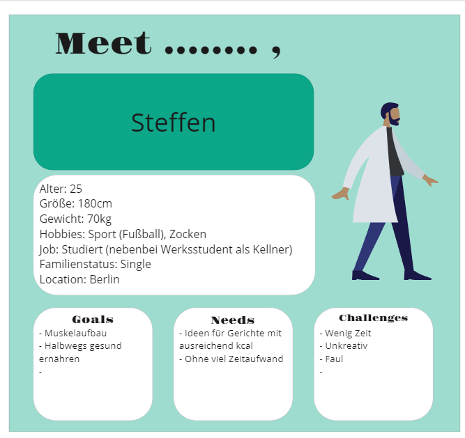

Michael Otieno
{: .label .label-red }
Justin Grünberg
{: .label .label-green }
Linus Widing
{: .label }

# Value proposition
{: .no_toc }

  

    Table of contents
  

  {: .text-delta }
- TOC
{:toc}

## Description
- Die App "CalorieCrave" ist eine **Rezept-App** im Social-Media-Stil für **Fitnessbegeisterte**.
- Zu den Kernfunktionen gehören eine **scrollbare "For-You-Page "** mit Rezepten und Nährwertangaben (kcal, Makros, etc.)
- Einfache und direkte Anzeige der Gerichte mit wichtigen Informationen
- **Filterfunktion** ermöglicht die Filterung nach kcal und Makros
- **Beiträge** kommen von verschiedenen **Nutzern** mit Gourmet- und einfachen Gerichten mit korrekten Nährwertangaben
- Nutzer können ein Profil anlegen, **Favoriten speichern** und Mengen- oder Diätlisten erstellen
- App ist **attraktiv gestaltet** für 20- bis 30-Jährige und intuitiv zu bedienen

## Persona

## Value Proposition 
Unsere App bietet Fitness-Enthusiasten und gesundheitsbewussten Essern Zugang zu einer social-Media-ähnlichen Rezept-Plattform mit Filterfunktionen für Kcal und Macros sowie einem optionalen Tracking-Feature, um Fortschritte zu verfolgen. 
Somit ist "Calorie Crave" auch die ideale App für Steffen, der sich neben seinem Studium und Job als Kellner gesund ernähren und Muskeln aufbauen möchte, ohne viel Zeit und Aufwand zu investieren. 
Mit der "For You"-Page und der Filterfunktion kann er schnell und einfach nach Gerichten suchen, die seinen Kalorien- und Makronährstoffbedarf decken und ihm helfen, seine Ziele zu erreichen. 
Steffen kann zwischen einer Vielzahl von Gerichten auswählen, die von verschiedenen Usern mit unterschiedlichem Erfahrungsgrad gepostet werden. 
Die einfache und übersichtliche Darstellung der Nährwertangaben in Kombination mit den Rezepten erleichtert ihm die Umsetzung einer gesunden Ernährung und unterstützt ihn dabei, seine Ziele zu erreichen.
Darüber hinaus kann Steffen seine Favoriten speichern und Listen für Bulk- oder Diät-Phasen erstellen, um seine Ernährung zu optimieren. 
Die Tracking-Funktion ermöglicht es ihm, seinen Fortschritt zu verfolgen und seine Ernährung gezielt anzupassen.
Durch die Anwendung der App "CalorieCrave" kann Steffen Zeit sparen und ohne großen kreativen Aufwand gesunde Gerichte für seinen Alltag finden, um seine Ziele effektiv zu erreichen.

## Goals And Ambitions
Zusammen als Gruppe ist es unser Ziel alle Kernfunktionen der App zu implementieren und dabei auch das UI unseren Anforderungen entsprechend zu gestalten.
Außerdem möchten wir natürlich den Anforderungen des Kurses gerecht werden.
Es ist uns auch wichtig außerhalb der Note des Kurses etwas aus diesem Projekt mitzunehmen. 
Wir wollen den Workflow mit Git und andere wichtige Elemente in der Entwicklung festigen, um somit auch besser auf die Praxis vorbereitet zu sein.
Wir versuchen also die App so weit umzusetzen, dass wir sie auch selber im Alltag nutzen könnten.
